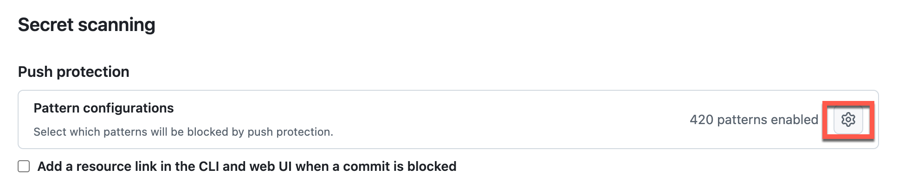
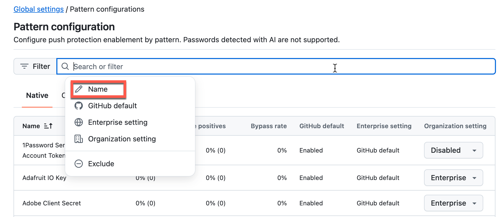
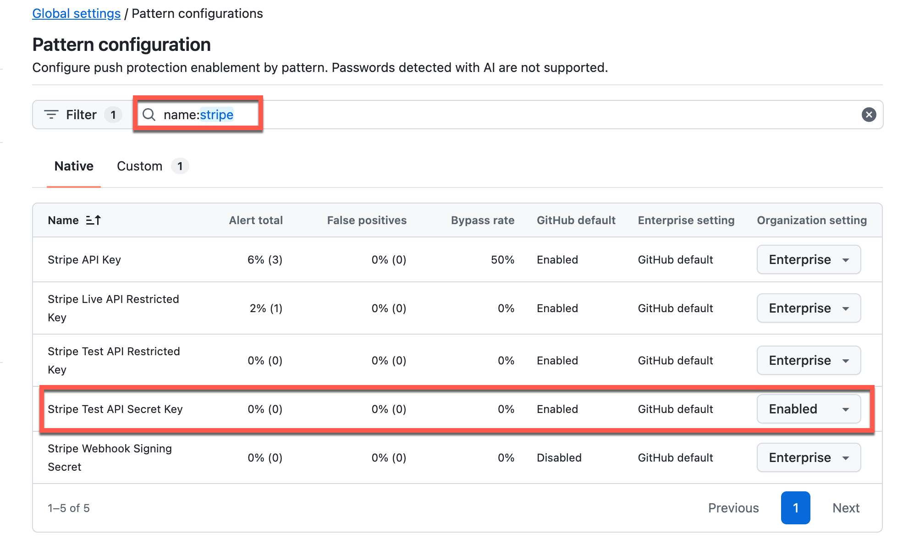
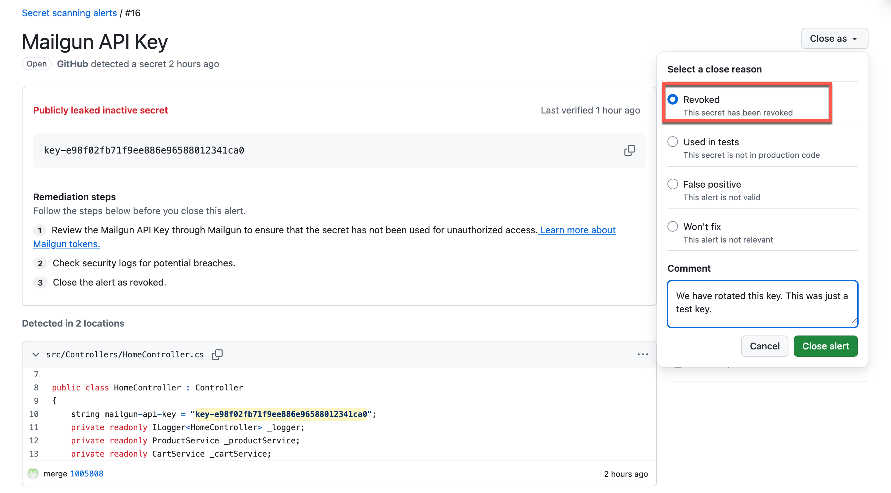
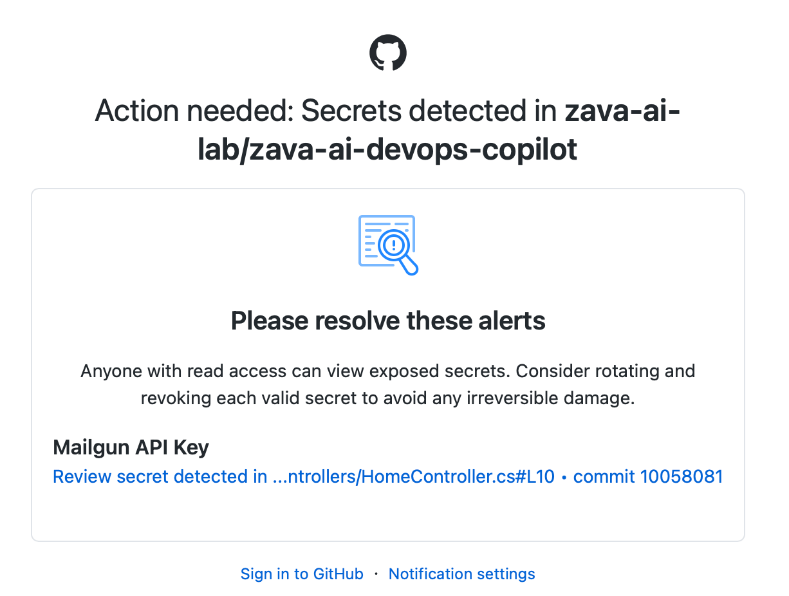

# Task 02 - Prevent secrets from being stored in code


## Introduction

Now that GitHub Enterprise security features are configured, you will make changes to the code and observe how secret scanning features can help you prevent committing secrets to your repository.

## Description

GitHub Advanced Security includes secret scanning. In this task you will see how your security configuration prevents secrets from being introduced into a GitHub repository.

## Success Criteria

- You have prevented secrets from being added to your repository

## Key Tasks

### 01: Verify secret scanning pattern configurations

Verify the secret scanning pattern configurations in your organization's Advanced Security settings and enable the Stripe Test API Secret Key pattern for push protection.

> **NOTE** You can also apply these settings at the enterprise level so that they apply to all organizations.

<details markdown="block">
<summary><strong>Expand this section for detailed steps</strong></summary>

1. Navigate to your organization on GitHub online and select the Settings tab. From the left menu select Advanced Security -> Global Settings.

2. Select the Secret scanning menu and in the Push protection section, select the configuration icon to review pattern configurations.

    

3. Select the Name filter and enter: `name:stripe` to filter the list.

    

4. Enable the `Stripe Test API Secret Key` pattern.

    

</details>

### 02: Add secrets to the solution

Add secrets to the solution code to test how GitHub Advanced Security detects and prevents committing secrets to the repository.

<details markdown="block">
<summary><strong>Expand this section for detailed steps</strong></summary>

1. Go to the solution in Visual Studio Code.

2. Open the `src/appsettings.json` file. Add the following settings (secrets) and save the changes:

    ```json
    "secrets": {
      "users": [
        { "username": "admin", "password": "XXX" }
      ],
      "database": {
        "connectionString": "Server=tcp:zavadbserver.database.windows.net,1433;Initial Catalog=zavadb;Persist Security Info=False;User ID=sa;Password=XXX;MultipleActiveResultSets=False;Encrypt=True;TrustServerCertificate=False;Connection Timeout=30;"
      }
    }
    ```

    You will replace `XXX` with `secret` when you paste it into the code.

3. Open the `/src/Controllers/CartController.cs` file. Add the following variables (secrets) to the class and save the changes:

    ```csharp
    public class CartController : Controller
    {
        string stripe_key = "ZZZZokikJOvBiI2HlWgH4olfQ2";
        string admin_password = "XXX";

        ...
    }
    ```

    You will replace `ZZZZ` with `sk_test_BQ` when you paste it into the code.

> **NOTE** GitHub scans the entire repository and since the documentation also is scanned the secrets cannot be placed in the documents or they become part of GitHub commit history and will either prevent you from pushing changes, or be picked up by the Dependabot scans.

</details>

### 03: Try to commit the changes

Attempt to commit and push the changes containing secrets to observe how GitHub Advanced Security push protection blocks the commit.


<details markdown="block">
<summary><strong>Expand this section for detailed steps</strong></summary>

1. From Terminal, issue the commands to add your changes and commit:

    ```bash
    git add .
    git commit -m 'adding secrets'
    git push
    ```

2. The push will be rejected with an error message. The output, after you attempt to push, should be similar to the following:

    ```bash
    remote: error: GH013: Repository rule violations found for refs/heads/docs.
    remote:
    remote: - GITHUB PUSH PROTECTION
    remote:   —————————————————————————————————————————
    remote:     Resolve the following violations before pushing again
    remote:
    remote:     - Push cannot contain secrets
    remote:
    remote:
    remote:      (?) Learn how to resolve a blocked push
    remote:      https://docs.github.com/code-security/secret-scanning/working-with-secret-scanning-and-push-protection/working-with-push-protection-from-the-command-line#resolving-a-blocked-push
    remote:
    remote:
    remote:       —— Stripe Test API Secret Key ————————————————————————
    remote:        locations:
    remote:          - commit: 51ff6b29cc5ed9b67287f50a04b6792a6208f669
    remote:            path: src/Controllers/CartController.cs:8
    remote:          - commit: e156fefac93afc71b38a503ef935e2ce0581522c
    remote:            path: src/Controllers/CartController.cs:10
    remote:
    remote:        (?) To push, remove secret from commit(s) or follow this URL to allow the secret.
    remote:        https://github.com/zava-ai-lab/zava-ai-devops-copilot/security/secret-scanning/unblock-secret/35A2vGmTz1y1ZUXYGXVVVF6e7zq
    remote:
     ! [remote rejected] docs -> docs (push declined due to repository rule violations)
    error: failed to push some refs to 'https://github.com/zava-ai-lab/zava-ai-devops-copilot.git'

    ```
</details>

### 04: Remove the secrets from the solution code and local commits

Remove the secrets from your code and reset your local commit history to remove secrets from the Git history before pushing again.

<details markdown="block">
<summary><strong>Expand this section for detailed steps</strong></summary>

1. In Visual Studio Code, open the `src/Controllers/CartController.cs` file and remove the `stripe_key` variable that was listed as rejecting the push command. If any other secrets were listed as blocking, remove those as well.

2. Save the changes and try once again to commit and push the changes to your current branch:

    ```bash
    git add .
    git commit -m 'adding secrets'
    git push
    ```

    This step will fail since the commit history still has the secret.

3. Reset the commit history to match the remote branch to remove the secrets from Git history:

    ```bash
    git reset --hard origin/<your_branch_name>
    ```

    Once you have done this, you will be able to push changes to this branch so long as there are no secrets remaining in the code.

</details>

### 05: Review secret scanning alerts

Review secret scanning alerts in your repository's Security tab to see secrets that were detected after being pushed to the repository, even if they weren't blocked by push protection.

> **NOTE** Since the secrets have entered the repository, they are no longer safe. You have to explicitly close the alert and indicate how you have mitigated the concern such as revoking the key from use in your solution.

<details markdown="block">
<summary><strong>Expand this section for detailed steps</strong></summary>

1. Navigate to the Security tab for the repository. Select the Secret scanning menu under Vulnerability alerts.

2. Select Default alerts and it will show the API keys that were not rejected by the repository push.

    

3. Select Generic alerts and it will show secrets that were not rejected by the repository push.

    

4. Select one of the alerts so you can close it. Choose a close reason from the list.

    

5. Based on your notification settings, you may also receive email alerts.

    

## Summary

You've completed this task. You have prevented secrets from being added to your repository and reviewed secret scanning alerts.
