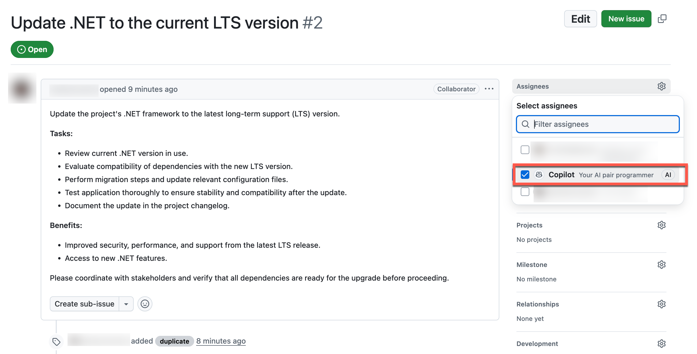
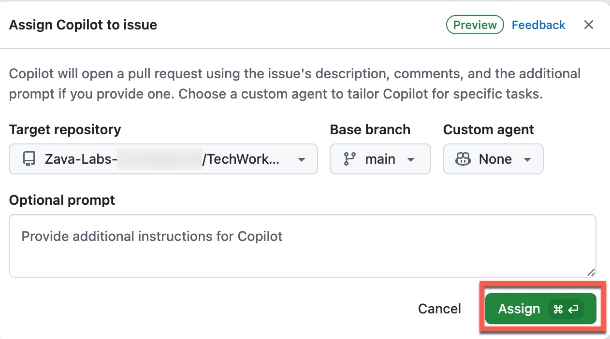
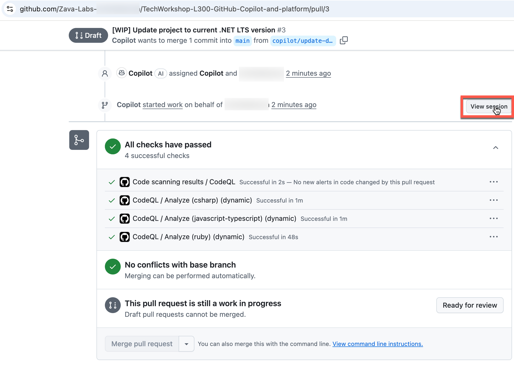
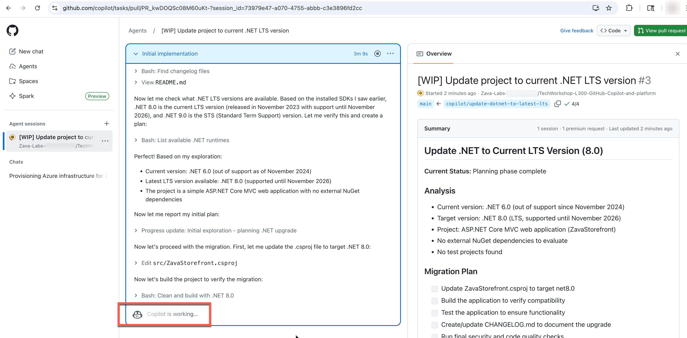
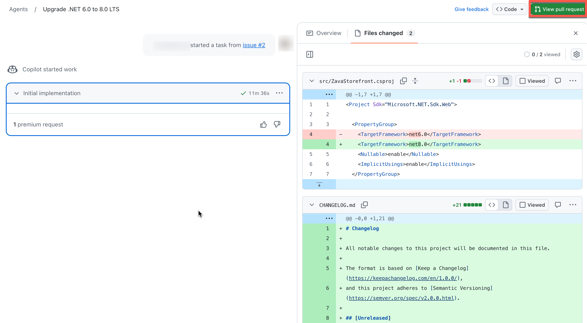
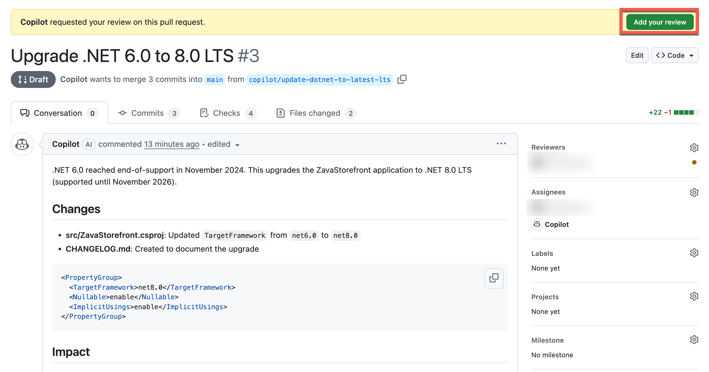
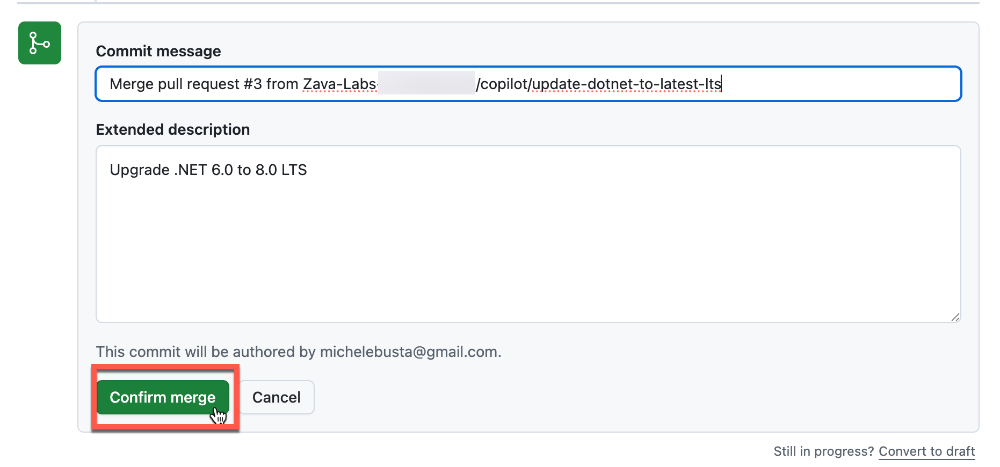

# Task 02 - Use GitHub Copilot to update .NET versions

## Introduction

Zava has a starting point for the Zava Storefront that is based on .NET 6. Since Zava as an organization is committed to improving developer efficiency with AI, they want to explore what Copilot can do to create issues and also automate the update to the latest .NET LTS version.

In the previous task you used Copilot to create the issue and now you will assign Copilot implement the issue and perform the upgrade. 

## Description

In this task you assign Copilot to do the work to implement the .NET upgrade.

## Success Criteria

- The solution is updated to .NET LTS

## Key Tasks

### 01: Assign Copilot to the .NET Upgrade issue

After selecting the new issue created by Copilot, you will assign Copilot to implement the issue and create a pull request with the changes. 

<strong>Expand this section for detailed steps</strong>

1. Select the issue in GitHub online as you did in the previous exercise. 

2. Assign Copilot to the issue. 

    
    

3. Copilot will start analyzing the solution for the changes necessary to update the solution code to .NET LTS. You can select 'View session' to watch this work in progress. 

    
    

    > **NOTE** It make take 5-10 minutes for the upgrade pull request to be created. 

### 02: Review the pull request created by Copilot

After Copilot completes the implementation of the issue, you can review the pull request created by Copilot, and accept the merge. 

<strong>Expand this section for detailed steps</strong>

1. Once the pull request is ready you can view it and select 'Add your review'.

    
    

2. Merge the pull request. Select 'Merge pull request' and then 'Confirm merge'.

    
    

## Summary

You've completed this task. The branch Copilot created with the .NET LTS update has now been merged to main after Copilot completed building the solution, executing any GitHub actions including code and quality reviews. 
