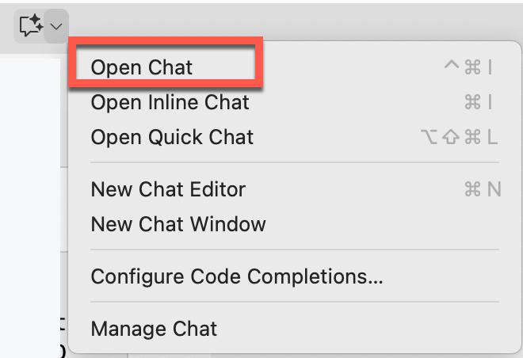
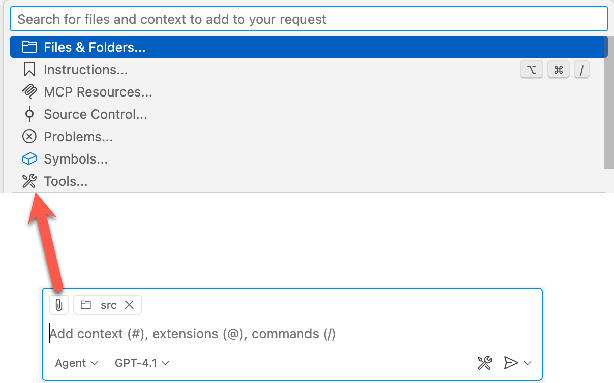

# Task 03 - Use GitHub Copilot to create a Chatbot

## Introduction

Zava would like for the Zava Storefront solution to include a Chatbot to allow its customers to inquire about products and pricing. To get this moving forward they would like to see what their developers can get started with Copilot.

## Description

In this task you will use Copilot to create an issue to create a Chatbot feature for the Zava Storefront and implement the feature.

## Success Criteria

- The application has a new Chat page that is connected to an existing Azure AI Foundry model

## Key Tasks

### 01: Create an Issue to describe the Chatbot feature

Launch GitHub Copilot Chat in Visual Studio Code to begin creating the chatbot feature issue.

<details markdown="block">
<summary><strong>Expand this section for detailed steps</strong></summary>

1. From Visual Studio Code, launch Copilot Chat:

    

</details>

### 02: Set the Copilot Chat context

Set the Copilot Chat context to both the `/src` and `/infra` directories so Copilot has access to the relevant code and infrastructure files.

<details markdown="block">
<summary><strong>Expand this section for detailed steps</strong></summary>

1. Set the context to the `/src` and `/infra` directories. You can click the attachment icon in the chat window and select from the dropdown list Files & Folders, then `src`. Do that again for `infra`.

    

</details>

### 03: Create a GitHub issue with Copilot in Chat

Use the `/create-issue` command in Copilot Chat to generate a GitHub issue describing the chatbot feature requirements.

<details markdown="block">
<summary><strong>Expand this section for detailed steps</strong></summary>

1. In the chat window type `/create-issue ` followed by your prompt text. In this case you want to prompt indicating you want to add a new feature, for example:

    ```text
    /create-issue Add a new feature:
    - Add a simple chat functionality as a separate page that will send a text to an Azure AI Foundry endpoint and will add the result to an existing text area.
    - Configure this feature to use the Phi4 endpoint that is already deployed
    ```

2. This will trigger actions that will look something like this:

    

3. Once Copilot is done, you will see a response similar to this:

    

</details>

### 04: Create the feature with Copilot in Chat

Use Copilot Chat to implement the issue you created, allowing Copilot to analyze the solution and propose changes to add the chatbot feature.

<details markdown="block">
<summary><strong>Expand this section for detailed steps</strong></summary>

1. From the chat window create a prompt to implement the issue, for example:

    ```text
    @workspace implement issue #<your_issue_number>
    ```

    > **NOTE** You can also prompt immediately after you create the issue with a prompt similar to this: `@workspace implement this issue`.

2. Copilot will start analyzing the solution and propose changes that are necessary to implement the feature, for example:

    

3. Once you have reviewed the proposed changes, you can instruct Copilot to accept the changes using a prompt similar to this:

    ```text
    Execute the proposed changes
    ```

4. Copilot will begin updating the solution and ask for your approval for each change:

    

5. After all the changes are approved, you will see a response similar to this:

    

6. If you agree with the changes, select Keep. This will save the updated files locally for you.

    

</details>

### 05: Compile and run the updated solution

Build the solution and configure it to use your previously deployed Phi-4 model from Azure AI Foundry.

<details markdown="block">
<summary><strong>Expand this section for detailed steps</strong></summary>

1. Build the solution to make sure that everything works.

2. To run the application, you will have to configure it to use your previously deployed Phi-4 model. One of the files generated by Copilot during the implementation step contains the setup instructions:

    

3. The instructions will look something similar to this:

    

4. To configure the application, you can either update those files to include your AI Foundry deployment configuration, define those as dotnet user-secrets, or as environment variables.

</details>

### 06: Commit the changes

Commit the chatbot feature code to your current branch after verifying the solution works correctly.

<details markdown="block">
<summary><strong>Expand this section for detailed steps</strong></summary>

1. If the solution is working as expected, commit the code to your current branch.

</details>

## Summary

You've completed this task. The application has a new Chat page that is connected to an existing Azure AI Foundry model.
